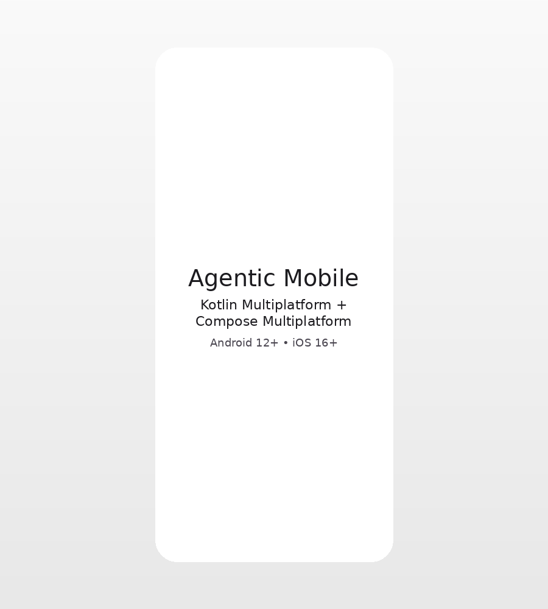

# Agentic Mobile

A minimal Kotlin Multiplatform mobile starter app with a shared Compose Multiplatform UI for Android and iOS.

## Preview



The preview image was generated from `scripts/generate_preview.py` as a lightweight mock of the starter screen.

To refresh it:

```bash
python -m pip install pillow
python scripts/generate_preview.py
```

## Targets

- Android 12.0 and higher (`minSdk = 31`, API 31+)
- iOS 16 and higher

## Identifiers

- Android application ID: `de.mistatee.agenticmobile`
- iOS bundle identifier: `de.mistatee.agenticmobile`

## Run the app

### Android

```bash
./gradlew :composeApp:assembleDebug
```

Open the project in Android Studio to run the Android app.

### iOS

Open `iosApp/iosApp.xcodeproj` in Xcode and run the `iosApp` target on an iOS 16+ simulator or device.
